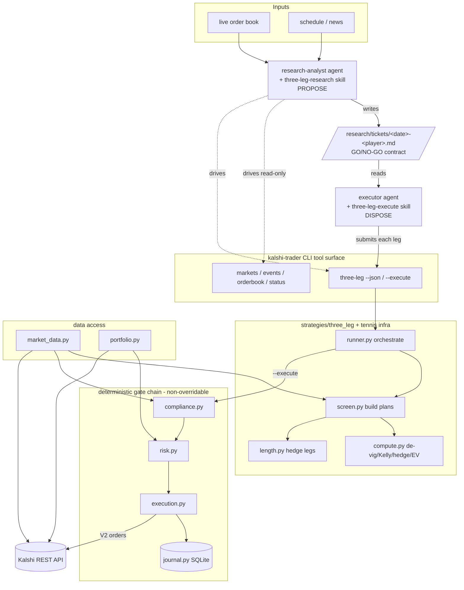

# Codebase Evaluation — Capman-A-Team / kalshi-agent-trader

A single top-to-bottom tour of what every live module does and how the pieces fit
together. This is **explanation only** — behaviour and data flow, no critique or
recommendations. It complements, and does not replace, the existing docs (see
[Where the other docs live](#where-the-other-docs-live)).

> The repository is named **Capman-A-Team**, but there is no `Capman-A-team/`
> directory — all code lives directly under `kalshi-agent-trader/`.

---

## Big picture

The system's whole contract is one sentence:

> **LLM agents PROPOSE. Deterministic Python gates DISPOSE.**

A **research agent** screens the live order book and writes a GO/NO-GO **trade ticket**
(a markdown file). An **executor agent** reads that ticket, re-checks freshness and
price drift, and routes each leg through a fixed `compliance → risk → execution → journal`
chain. The only committed strategy is the **three-leg French-Open fatigue hedge**: back a
quarter-final favourite to win the match (Leg 1) and the title (Leg 2), plus a
length/fatigue hedge (Leg 3) that pays when the favourite advances drained.

The **judgment** lives in prompts (Claude Code subagents + skills); the **sizing math and
the gates** live in tested Python. The `kalshi-trader` CLI (a 14-command Typer app) is the
tool surface both agents drive: read-only commands feed research, the write path is the
executor's and is always gated.

**The prompt / code boundary:**

| Concern | Where | Why |
|---|---|---|
| Data access (markets, orderbook, portfolio) | **Python** — `client`, `market_data`, `portfolio` | Deterministic I/O |
| Sizing math (de-vig, Kelly, hedge-ratio, set-proxy, EV) | **Python** — `strategies/three_leg/{compute,screen,length}.py` | Reproducible, unit-tested |
| compliance → risk → execution → journal | **Python** — `compliance`, `risk`, `execution`, `journal` | PEAK6 hard gate; non-overridable |
| Opportunity selection, edge re-confirmation, GO/NO-GO, ticket authoring | **Prompt** — `research-analyst` agent + `three-leg-research` skill | The judgment layer |
| Staleness/drift checks, faithful submission, human-in-the-loop | **Prompt** — `executor` agent + `three-leg-execute` skill | Orchestration + discipline |
| Trade ticket (the hand-off) | **Markdown** — `research/tickets/` | Self-contained contract + audit trail |

**Safety posture:** `config.yaml` ships with `risk.dry_run: true`; the structure backtested
~flat-EV, so nothing trades live until that flag is flipped *and* a GO ticket is
human-confirmed. The research agent's default verdict is **NO-GO** — a GO must name a
specific, defensible edge.

---

## Architecture diagram



The same flow, in ASCII (mirrors `docs/ARCHITECTURE.md` for quick terminal reading):

```
                 ┌─────────────────────────┐
   live book ───▶│  research-analyst (agent)│  judgment: screen, re-confirm edge,
   schedule ───▶ │  + three-leg-research    │  pick ≤1 title anchor, decide GO/NO-GO
   news     ───▶ │  skill                   │
                 └────────────┬─────────────┘
                              │ writes
                              ▼
                   research/tickets/<date>-<player>.md      ◀── the PROPOSE→DISPOSE contract
                              │ reads
                              ▼
                 ┌─────────────────────────┐
                 │  executor (agent)        │  discipline: validate freshness + drift,
                 │  + three-leg-execute     │  dry-run first, human-confirm for live
                 │  skill                   │
                 └────────────┬─────────────┘
                              │ submits each leg
                              ▼
        compliance ─▶ risk ─▶ execution ─▶ journal     (deterministic Python; non-overridable)
```

---

## Core infrastructure

**`config.py`** — Loads `config.yaml` + `.env` into typed objects and is the single entry
point for all settings. `SecretsConfig` reads API keys via pydantic-settings; `ComplianceConfig`,
`RiskConfig`, `RuntimeConfig`, and `StrategyConfig` come from `config.yaml`. `load_config()`
assembles and returns the `AppConfig`. Prices/amounts are coerced to `Decimal`.

**`auth.py`** — RSA-PSS request signer (SHA-256 / MGF1-SHA256 / salt 32). Signs the string
`f"{timestamp_ms}{METHOD}{path}"` (path excludes the query string) and returns the three
`KALSHI-ACCESS-KEY` / `-TIMESTAMP` / `-SIGNATURE` headers.

**`client.py`** — Synchronous Kalshi REST client. Builds URLs against the configured base,
signs authenticated requests via `auth.py`, throttles client-side to stay under the Basic
rate-limit tier, and retries transient errors (timeouts, 5xx, 429) with backoff. Read
endpoints (markets/events/series/orderbook) are public and unsigned.

**`models.py`** — Pydantic models for Kalshi API objects: `Market`, `Event`, `Series`,
`Orderbook`, `Balance`. Encodes the verified-live facts: prices are **dollar strings**
(parsed to `Decimal`), `category` lives on the **event** not the market, and the orderbook
is `{"orderbook_fp": {"yes_dollars": [...], "no_dollars": [...]}}`. Uses `extra="ignore"`
to stay resilient to renamed/added API fields.

**`journal.py`** — Append-only SQLite audit log (`data/trader.db`). Records every signal,
every gate outcome (with reasons), every order, and every fill across tables `decisions`,
`orders`, `fills`, `positions`. Rejections are logged with reasons — central to the PEAK6
auditability requirement. Also defines `PROJECT_ROOT`.

**`util.py`** — Small shared helpers with one definition each: `hours_until()` (ISO
timestamp → hours from now) and `volume_fp()`. Extracted so they aren't copy-pasted across
modules.

**`render.py`** — Rich rendering helpers for the CLI: generic value formatters
(`_fmt_money`, `_fmt_cents`, …) plus the French-Open breakeven/fade table builders. A leaf
module (imports only rich, stdlib, and `tennis_screen` row types) that keeps `cli.py` thin.

**`cli.py`** — The Typer app exposing the `kalshi-trader` command surface (14 commands; see
[CLI reference](#cli-reference)). Wires config → client → data/portfolio → gates → strategy
runners and renders results with `render.py`.

**`__init__.py`** — Package marker (a trivial `hello()` placeholder).

---

## The gate chain

Every order reaches Kalshi through exactly one path — `Executor.submit()` — which runs
three steps in a **fixed, non-overridable order**, journaling every outcome
(`placed` / `dry_run` / `rejected`):

```
compliance ──▶ risk ──▶ execution ──▶ journal
```

**`compliance.py`** — The PEAK6 hard gate, deny-biased and run first. A market trades only
if its (event-derived) category is **known**, **not** in `prohibited_categories`, **is** in
`allowed_categories`, and its title contains **no** prohibited keyword. Allowed: Politics,
World, Climate and Weather, Sports. Prohibited: Financials, Companies, Crypto, Economics.
Unknown categories are default-deny. `check_market()` resolves the category via
`market_data.category_for_market` then calls the pure, network-free `evaluate()`. No config
flag or agent can override it.

**`risk.py`** — Configurable caps enforced after compliance, plus two invariants that hold
regardless of config: a **kill switch** (a sentinel file `data/KILL` halts all new entries)
and **no leverage** (total exposure can never exceed live balance). It vets a `ProposedOrder`
against an `AccountState` (balance, total exposure, per-market exposure, daily realized P&L),
checks signal-quality gates (min confidence, min edge) and the daily-loss cap, then **clamps
size**: it converts every dollar "room" (balance, total-exposure cap, per-position cap,
per-order cap) into a max contract count and takes the **tightest** binding cap. It returns
`approved_count` (possibly reduced); if no positive size fits, the order is rejected.

**`execution.py`** — The single write path. `submit()` calls compliance, then risk (applying
the clamp via `replace(order, count=approved_count)`), then either dry-runs (log only) or
POSTs the V2 order. `build_v2_order_body()` isolates the V2 field names: `book_side` (`bid`=yes,
`ask`=no), `price` as FixedPointDollars (`"0.5600"`), `count` as FixedPointCount (`"10.00"`),
`good_till_canceled`, with a UUID `client_order_id` for idempotency. Uses
`POST /portfolio/events/orders` (V1 is deprecated). `cancel()` issues the V2 DELETE. Every
outcome is journaled.

---

## Data access

**`market_data.py`** — Fetches markets, events, series, and orderbooks. Its key compliance
responsibility is **resolving a market's category**: since `category` is on the event,
it fetches the event for a market's `event_ticker` and caches the `event_ticker → category`
map. `category_for_market(market)` is the helper the compliance gate and the screens use.

**`portfolio.py`** — Authenticated reads: balance, market positions, resting orders, and
fills. `account_state(ticker)` assembles the `AccountState` the risk gate needs (live
balance, current total exposure, exposure in this market, today's realized P&L).

---

## Three-leg strategy (the committed strategy)

Lives in `strategies/three_leg/`, with shared tennis infrastructure at the package top level.
All three legs are YES buys on the backed favourite:

- **Leg 1 — match YES:** favourite wins the quarter-final.
- **Leg 2 — title YES:** favourite wins the tournament.
- **Leg 3 — length hedge:** favourite wins, but in a *long* match (men 3-1 / 3-2; women 2-1),
  cushioning the fatigue risk a draining win imposes on the deep-run title leg.

**`compute.py`** — Pure sizing + P&L math (all `Decimal`, no I/O). `kelly_fraction()` gives
the full-Kelly stake fraction for a YES buy (0 when there's no edge); `size_leg()` Kelly-sizes
Legs 1 & 2 from the de-vigged market mid plus an optional directional `edge`, scaled by the
config's `kelly_fraction` cap. The hedge is **not** a directional bet: `hedge_ratio()` =
`clamp(fatigue_coef · extra_sets / rest_days, 0, 1)` (shorter QF→SF turnaround ⇒ bigger
ratio), and `size_hedge_leg()` sets `long_contracts = round(title_contracts · ρ)` — with no
title leg there is nothing to hedge, so it refuses a naked duration bet. `ThreeLegPlan` holds
the legs, the de-vigged `Outcome` set, and computes `net_pnl()` per QF result and
`expected_value()` (splitting each win on title vs no-title via `p_title_given_advance`).

**`screen.py`** — The I/O layer that assembles plans from the live book. For each open match
in the chosen gender(s) it picks the favourite (higher YES mid), pairs the title market by
**competitor UUID** (as `tennis_screen` does), discovers the length legs, and Kelly-sizes all
three. Defines `ThreeLegParams` (bankroll, kelly fraction, fatigue coef, edges, …) and
`build_plans()`.

**`length.py`** — Discovers the Leg-3 "length" instrument: the exact-match-score market under
the sibling series (`KXATPMATCH-<sfx>` ⇒ `KXATPEXACTMATCH-<sfx>`, women analogous), parses
winner + set score from `yes_sub_title`, and de-vigs the favourite's win-by-score outcomes.
The long ones (`sets_lost ≥ 1`) become hedge legs. If the sibling market isn't listed yet
(common for women's matches until close to play), it returns no candidates and a note, and
the plan degrades to two legs.

**`orders.py`** — Translates a sized plan into `ProposedOrder`s for the gate chain. Every leg
is a YES buy as a limit at the ask it was sized against; only legs that Kelly-sized to ≥1
contract are emitted.

**`render.py`** — Rich rendering for the planner: the terminal view (`build_three_leg_view`)
and the machine-readable snapshot (`build_three_leg_json`) the research agent consumes.

**`runner.py`** — One-shot orchestration: `fetch → size → render → (optional) execute`. It's
pre-match positioning, so a single snapshot, no poll loop. `--json` prints the snapshot and
never executes. `--execute` routes each sized leg through `Executor`, honouring
`config.risk.dry_run` (in dry-run it uses a bankroll-only `AccountState`; live, it pulls real
state from `Portfolio`). Plans whose length hedge isn't live yet are flagged as pending.

**Shared tennis infra (package top level):**

**`tennis_screen.py`** — Selects and pairs French-Open match + tournament-winner markets for
the same player. Pairing is by `custom_strike.tennis_competitor` UUID (not name); the display
name is used only for display and the `--player` filter. I/O is through an injected
`MarketData` for testability.

**`breakeven.py`** — Two-market breakeven math for a tennis hedge (pure, no I/O): pairs a
match-NO leg with a title-YES leg and computes the locked floor when the player loses today and
the breakeven title price after a win (with equal stakes, `t* = 2·t0`). Includes the fee math.

---

## Post-fill + feedback

**`hedge.py`** — Exit-vs-hedge math for an *open* position (pure, no I/O; places nothing).
Scores each candidate way to lay off risk and always compares it to simply **exiting**,
surfacing the exit baseline and flagging hedges dominated by it. Classifies each hedge as
`OPPOSITE` (other side of the same market — a clean lock), `EQUIVALENT` (a different market on
the logically identical event), or `CORRELATED` (a partial hedge that pays in the lose-case but
not only then). Driven by the `hedge` CLI command and the `find-hedge` skill.

**`analysis/calibration.py`** — Brier-scores closed positions against realized Kalshi
settlement — the feedback loop the journal enables but doesn't itself compute. It's
strategy-agnostic: it scores whatever proposed a position, so it survives changes to how
trades are sourced. For each closed position it fetches the market's `result`, derives the
realized outcome for the traded side (1.0 if that side won), recovers the predicted `fair_prob`
from the latest placed/dry-run `decisions` row at/before open (flipping it if the position side
differs), and accumulates Brier stats overall and bucketed by source and category. Unsettled
markets and positions with no recoverable prediction are skipped. Read-only; surfaced via the
`calibrate` CLI.

---

## Prompt layer (the judgment, not in Python)

The research/executor split lives in prompts, not code. The handoff is a markdown ticket.

| File | Role |
|---|---|
| `.claude/agents/research-analyst.md` | **PROPOSE** — screen QF favourites, re-confirm a specific edge, write a GO/NO-GO ticket. Default verdict NO-GO; never touches the order path. Model: opus. |
| `.claude/agents/executor.md` | **DISPOSE** — validate a GO ticket's freshness + price drift, run the gate chain, dry-run by default, refuse stale/drifted tickets rather than "fix" them. Model: sonnet. |
| `.claude/skills/three-leg-research/SKILL.md` | Research playbook: edge checklist + ticket rubric. |
| `.claude/skills/three-leg-execute/SKILL.md` | Execution playbook: staleness/drift checks, human-confirmation gate. |
| `.claude/skills/find-hedge/SKILL.md` | Post-fill de-risk playbook (drives `hedge.py`). |
| `research/tickets/TEMPLATE.md` | The trade-ticket contract — the self-contained, on-disk hand-off between the two agents. |

**The handoff:** research-analyst reads the live book (via `three-leg --json`, `markets`,
`orderbook`, `status`) and web sources, decides GO/NO-GO, and writes
`research/tickets/<date>-<player>.md`. The executor reads that ticket, re-checks it against the
live book, and — only on explicit per-ticket human confirmation when live — submits each leg
through the gates.

---

## Attic (retired, kept in-tree, unwired)

`src/kalshi_agent_trader/attic/` holds the exploration phase. None of it is imported by the
CLI, config, or gates; relative imports inside are dormant. One line each:

| Module | What it was |
|---|---|
| `scanner.py`, `brain.py`, `pipeline.py` | Longshot-bias systematic core: scan cheap tails → quarter-Kelly sizing → execute. |
| `monitor.py` | Generic position exit-trigger poll loop (target hit / near-expiry / stale thesis / resolved). |
| `polymarket.py` | Polymarket Gamma API reference-price client (title-similarity matching) for cross-calibration. |
| `agents/` | Generic Claude market scanner/analyst (`base.py`, `market_agent.py`, `agent_strategy.py`). |
| `relative_value/` | Kalshi-only relative-value signals from external reference prices. |
| `dip_reversion/` | Intraday title-dip mean-reversion (the one play that backtested net-positive). |

Their tests live under `tests/attic/` and are excluded from collection
(`pyproject.toml → [tool.pytest.ini_options]`). To revive one: move it back into the package,
restore imports, re-add its CLI command, and move its test back.

---

## CLI reference

`uv run kalshi-trader <command>` — a Typer app (`cli.py`, 14 commands).

| Command | Auth? | What it does | Backed by |
|---|---|---|---|
| `exchange` | No | Exchange status | `client` |
| `status` | Yes | Account balance + open positions | `portfolio` |
| `positions` | Yes | List current positions | `portfolio` |
| `auth-check` | Yes | Verify key + signing (returns balance) | `auth`, `client`, `portfolio` |
| `markets` | No | List open markets | `market_data` |
| `events` | No | List events with categories | `market_data` |
| `orderbook <TICKER>` | No | Show an order book | `market_data` |
| `order` | Yes | Place one order manually (dry-run by default) | `execution` (full gate chain) |
| `cancel <ORDER_ID>` | Yes | Cancel a resting order | `execution` |
| `kill` / `unkill` | — | Engage / clear the kill switch (`data/KILL` sentinel) | `risk` |
| `three-leg` | No* | Screen QF favourites; `--json` = snapshot for research; `--execute` routes legs through the gates (*auth only when actually executing live) | `strategies/three_leg/runner` |
| `hedge` | Yes | Post-fill exit-vs-hedge for an open position (places nothing) | `hedge` |
| `calibrate` | Yes | Brier-score closed positions vs settlement (read-only) | `analysis/calibration` |

---

## Where the other docs live

This file is the consolidated tour. The pre-existing docs go deeper on specific aspects and
remain authoritative for them:

- **`README.md`** (repo root) — quickstart pointer; all code is in `kalshi-agent-trader/`.
- **`kalshi-agent-trader/README.md`** — setup, full CLI, the compliance model, and the
  verified-live Kalshi API notes (REST/WS bases, dollar-string prices, V2 orders, auth).
- **`kalshi-agent-trader/MODULES.md`** — the per-file quick reference (including archived modules).
- **`kalshi-agent-trader/docs/ARCHITECTURE.md`** — the research → ticket → executor flow and the
  prompt/code boundary table.
- **`kalshi-agent-trader/docs/EDGES.md`** — strategy rationale and the trading-edge feasibility analysis.
